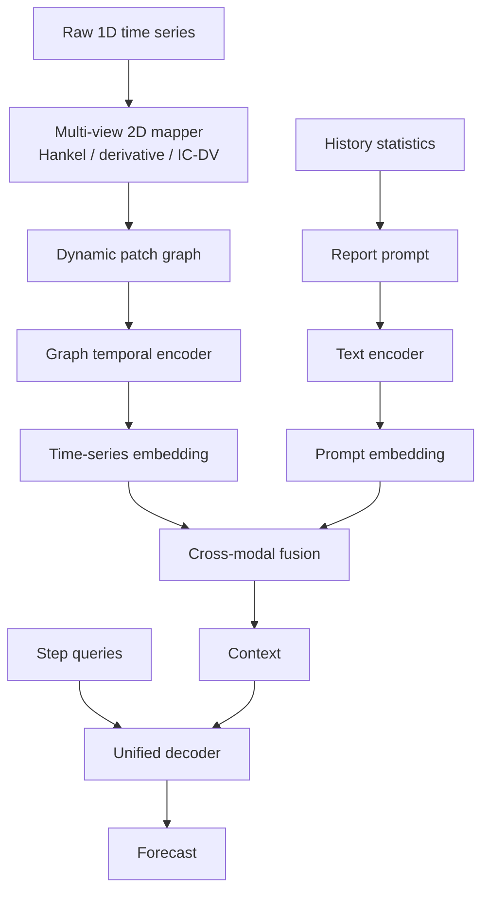

# GraphReportTS

GraphReportTS is a research codebase for battery state-of-health (SOH) forecasting and general time-series forecasting. The main model combines raw-signal 2D graph representations, statistical report prompts, cross-modal fusion, and a unified query decoder.

This repository contains source code, experiment scripts, and documentation only. Raw datasets, model checkpoints, downloaded HuggingFace weights, external baseline repositories, logs, and generated training artifacts are intentionally excluded.

## Overview

GraphReportTS has two supported settings that share one backbone:

- **Battery-GraphReportTS** predicts battery SOH from current, voltage, temperature, capacity, and optional IC/DV-derived channels.
- **General-GraphReportTS** supports standard long-term forecasting datasets with battery-specific channels removed.



## Repository Layout

```text
bstalignment/
  graph_report_model.py              GraphReportTS backbone
  graph_report_losses.py             training loss and regression metrics
  raw_signal.py                      raw 1D signal to 2D maps and graph nodes
  data_battery_raw.py                MIT/CALCE/XJTU battery dataset adapter
  data_general.py                    general forecasting dataset adapter
  train_graph_report.py              main training entry point
  infer_graph_report.py              inference and paper-style figures
  train_battery_official_baselines.py official baseline adapters
  run_ablation_suite.py              ablation runner
  precompute_battery_graph_cache.py  optional graph-cache precomputation
scripts/
  clone_battery_baselines.sh         clone official baseline repositories
  download_battery_data.sh           download public CALCE/XJTU data when available
  preprocess_battery_data.sh         build processed battery npz files
  run_battery_main*.sh               batch GraphReportTS experiments
  run_battery_*baseline*.sh          baseline experiments
  run_battery_*ablation*.sh          ablation experiments
docs/
  work_report.md                     current project report
  cloud_training_workflow.md         local editing and cloud training workflow
  reconstruction_audit.md            implementation audit
```

## Installation

Create an environment and install the Python dependencies:

```bash
pip install -r requirements.txt
```

Install a PyTorch build that matches your CUDA version. For CUDA 12.1, for example:

```bash
pip install torch torchvision torchaudio --index-url https://download.pytorch.org/whl/cu121
```

Official baselines require their source repositories under `external/`:

```bash
bash scripts/clone_battery_baselines.sh "$(pwd)"
```

`external/` is ignored by Git.

## Data

Expected battery data layout:

```text
bstalignment/data/mit
bstalignment/data/raw/battery/calce
bstalignment/data/raw/battery/xjtu
bstalignment/data/processed/battery/calce
bstalignment/data/processed/battery/xjtu
```

Processed CALCE/XJTU files are `.npz` files with:

```text
cycle_id [N]
soh [N]
current [N, L]
voltage [N, L]
temperature [N, L]
capacity [N, L] or enough time/current data to integrate capacity
```

General datasets follow the TimeCMA-style CSV layout:

```text
bstalignment/data/raw/general/<dataset>/<dataset>.csv
```

Supported general dataset names include `ETTm1`, `ETTm2`, `ETTh1`, `ETTh2`, `ECL`, `FRED`, `ILI`, and `Weather`.

## Main Training

Battery experiments should use raw cycle arrays. The summary fallback is only for smoke tests.

```bash
python -m bstalignment.train_graph_report \
  --variant battery \
  --dataset mit \
  --data_root bstalignment/data \
  --out_dir runs/graph_report_ts \
  --pred_len 20 \
  --text_model hf_models/distilbert-base-uncased
```

For constrained local smoke tests:

```bash
python -m bstalignment.train_graph_report \
  --variant battery \
  --dataset mit \
  --pred_len 20 \
  --allow_summary_fallback \
  --no_hf_text \
  --max_cycles 20 \
  --epochs 1
```

General forecasting:

```bash
python -m bstalignment.train_graph_report \
  --variant general \
  --dataset ETTm1 \
  --data_root bstalignment/data \
  --input_len 96 \
  --pred_len 96
```

## Baselines

Two baseline paths are available:

- `train_battery_baselines.py`: compact in-repository baselines for quick comparisons.
- `train_battery_official_baselines.py`: adapters that instantiate official PatchTST, iTransformer, TimeCMA, TimesNet, DLinear, and Time-LLM model definitions from repositories cloned under `external/`.

Example:

```bash
python -m bstalignment.train_battery_official_baselines \
  --model patchtst \
  --dataset mit \
  --data_root bstalignment/data \
  --external_root external \
  --out_dir runs/baselines
```

Time-LLM and TimeCMA can use local HuggingFace models through `--hf_gpt2_model` and `--hf_bert_model`. Downloaded model weights should stay outside Git, for example under ignored `hf_models/`.

## Ablations

Battery ablations cover IC/DV maps, Hankel maps, derivative maps, dynamic graph attention, domain edges, report prompts, cross-modal fusion, and decoder style.

```bash
python -m bstalignment.run_ablation_suite \
  --variant battery \
  --dataset mit \
  --data_root bstalignment/data \
  --out_root runs/graph_report_ablation \
  --pred_len 20 \
  --text_model hf_models/distilbert-base-uncased
```

Plot ablation tables:

```bash
python -m bstalignment.plot_experiment_tables \
  --table runs/graph_report_ablation/battery/mit/ablation_summary.csv
```

## Inference

```bash
python -m bstalignment.infer_graph_report \
  --checkpoint runs/graph_report_ts/battery/mit/best.pt \
  --split test
```

The inference script writes prediction CSV files and paper-style figures under the selected output directory.

## Notes

- Do not commit raw data, processed data, checkpoints, logs, `runs/`, `external/`, or local HuggingFace model folders.
- `TRANSFORMERS_OFFLINE=1` is supported when the text model has already been downloaded locally.
- `--allow_summary_fallback` exists only for smoke tests and should not be used for formal battery results.
