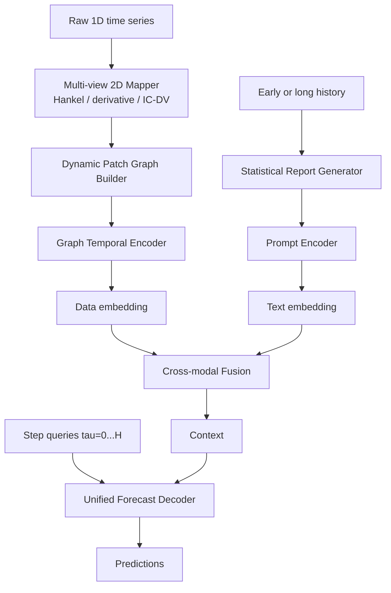

# GraphReportTS

GraphReportTS is a research codebase for battery SOH forecasting and general time-series forecasting.

The project contains two related stages:

- `BatteryCycleLLMAssist`: an early validated prototype using one-cycle battery features and structured prompts.
- `GraphReportTS`: the optimized research framework with raw-signal 2D graph representations, history-report prompting, and a unified query decoder.

## GraphReportTS Overview

GraphReportTS has two instantiations that share one backbone:

- `Battery-GraphReportTS`: battery SOH prediction from raw current, voltage, temperature, capacity, and optional IC/DV channels.
- `General-GraphReportTS`: general long-term forecasting with battery-specific channels removed.



## Key Files

```text
bstalignment/raw_signal.py             1D raw signal -> 2D maps -> patch nodes
bstalignment/graph_report_model.py     GraphReportTS model
bstalignment/data_battery_raw.py       MIT/CALCE/XJTU battery data adapter
bstalignment/data_general.py           TimeCMA-aligned general dataset adapter
bstalignment/train_graph_report.py     training entry point
bstalignment/infer_graph_report.py     inference and paper-style figures
bstalignment/run_ablation_suite.py     ablation runner
bstalignment/baseline_adapters.py      official baseline repository helper
bstalignment/paper_style.py            AAAI-style plotting utilities
docs/cloud_training_workflow.md        local Codex + cloud GPU workflow
docs/reconstruction_audit.md           implementation audit
```

## Data Layout

Battery data:

```text
bstalignment/data/mit
bstalignment/data/raw/battery/calce
bstalignment/data/raw/battery/xjtu
bstalignment/data/processed/battery/calce
bstalignment/data/processed/battery/xjtu
```

Processed CALCE/XJTU files should be `.npz` files with:

```text
cycle_id [N]
soh [N]
current [N, L]
voltage [N, L]
temperature [N, L]
capacity [N, L] or time/current arrays for capacity integration
```

General datasets follow the TimeCMA setting:

```text
ETTm1, ETTm2, ETTh1, ETTh2, ECL, FRED, ILI, Weather
```

Put CSV files under:

```text
bstalignment/data/raw/general/<dataset>/<dataset>.csv
```

## Install

```bash
pip install -r requirements.txt
```

Install a PyTorch build matching the cloud GPU CUDA version, for example:

```bash
pip install torch torchvision torchaudio --index-url https://download.pytorch.org/whl/cu121
```

## Train Battery-GraphReportTS

Formal battery experiments should use raw cycle arrays and should not use summary fallback:

```bash
python -m bstalignment.train_graph_report \
  --variant battery \
  --dataset mit \
  --data_root bstalignment/data \
  --out_dir runs/graph_report_ts \
  --pred_len 20
```

If raw MIT cycle arrays are not available and only a smoke test is needed:

```bash
python -m bstalignment.train_graph_report \
  --variant battery \
  --dataset mit \
  --pred_len 20 \
  --allow_summary_fallback \
  --no_hf_text
```

CALCE and XJTU after preprocessing:

```bash
python -m bstalignment.train_graph_report --variant battery --dataset calce --pred_len 20
python -m bstalignment.train_graph_report --variant battery --dataset xjtu --pred_len 20
```

## Train General-GraphReportTS

```bash
python -m bstalignment.train_graph_report \
  --variant general \
  --dataset ETTm1 \
  --data_root bstalignment/data \
  --input_len 96 \
  --pred_len 96
```

## Inference and Figures

```bash
python -m bstalignment.infer_graph_report \
  --checkpoint runs/graph_report_ts/battery/mit/best.pt \
  --split test
```

This writes:

```text
*_predictions.csv
*_scatter.png / *.pdf
*_step_mae.png / *.pdf
*_curve_*.png / *.pdf
```

## Ablations

Battery ablations include IC/DV, Hankel maps, derivative maps, dynamic graph, domain edges, report prompt, cross-modal fusion, and decoder style:

```bash
python -m bstalignment.run_ablation_suite \
  --variant battery \
  --dataset mit \
  --pred_len 20
```

General ablations:

```bash
python -m bstalignment.run_ablation_suite \
  --variant general \
  --dataset ETTm1 \
  --input_len 96 \
  --pred_len 96
```

Plot ablation tables:

```bash
python -m bstalignment.plot_experiment_tables \
  --table runs/graph_report_ablation/battery/mit/ablation_summary.csv
```

## External Baselines

Official baseline code is not vendored. To print or clone supported baseline repositories:

```bash
python -m bstalignment.baseline_adapters
python -m bstalignment.baseline_adapters --clone --names patchtst,itransformer,timecma
```

Supported baseline references include PatchTST, iTransformer, TimeCMA, TimesNet, DLinear, and Time-LLM.

## Cloud Training

The local PC can be used for Codex editing and GitHub commits, while heavy training runs on a rented cloud GPU server.

See:

```text
docs/cloud_training_workflow.md
```

## Notes

- Raw datasets, checkpoints, `runs/`, and external baseline repositories are intentionally excluded from Git.
- `--allow_summary_fallback` is for smoke tests only.
- Formal battery SOH experiments should use raw current, voltage, temperature, and capacity sequences.

