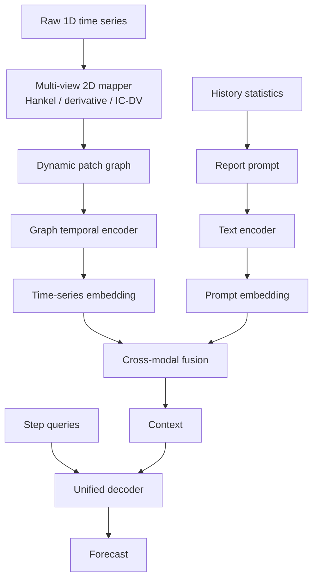

# GraphReportTS

GraphReportTS is a research codebase for battery state-of-health (SOH) forecasting and general time-series forecasting. The current implementation combines raw-signal 2D graph representations, statistical report prompts, cross-modal fusion, and a unified query decoder. The battery v3 protocol uses the baseline-aligned multi-cycle history model with source-native baseline training and adaptive main-model optimization.

This repository contains source code, experiment scripts, and documentation only. Raw datasets, model checkpoints, downloaded HuggingFace weights, external baseline repositories, logs, and generated training artifacts are intentionally excluded.

## Overview

GraphReportTS has two supported settings that share one backbone:

- **Battery-GraphReportTS** predicts battery SOH from current, voltage, temperature, capacity, and optional IC/DV-derived channels.
- **General-GraphReportTS** supports standard long-term forecasting datasets with battery-specific channels removed.



## Battery-GraphReportTS Architecture Context

The battery architecture is designed to fix the gap observed on MIT and XJTU against strong sequence baselines. This section preserves the implemented multi-cycle model context now trained under the v3 protocol.

Implementation status: the multi-cycle path is implemented with future-only battery targets, direct 32-cycle raw-map and numeric-history inputs, a first-version cycle-level `InterCycleTemporalEncoder`, relative future-step decoding, gated semantic fusion, weak optional alignment, and the corresponding ablations. The formal no-historical-SOH run uses the v3 entrypoint and output root documented below.

### Baseline-Aligned Input

Battery samples should use the same historical window as the baselines:

```text
recent history: 32 cycles
prediction horizon: future 20 cycles
metric target: future-only MSE / MAE / RMSE
```

The latest 32 cycles are fed directly into the model. Older history is not used as a raw tensor; it is summarized into degradation statistics and written into the report prompt.

### Multi-Cycle Raw Map Path

The first implementation should encode each recent cycle with the existing `GraphMapEncoder`, then model cycle-to-cycle aging dynamics:

```text
multi_cycle_maps [B, 32, C_map, H, W]
  -> shared GraphMapEncoder over [B*32, C_map, H, W]
  -> cycle_graph_repr [B, 32, D]
  -> InterCycleTemporalEncoder
  -> temporal_graph_context [B, D]
```

`InterCycleTemporalEncoder` is intentionally a first-pass cycle-level temporal encoder, not a full patch-level spatio-temporal attention model. The recommended first version is a small Transformer encoder over `[B, 32, D]` cycle embeddings. If training resources allow, a later version can keep all patch tokens and perform cross-cycle attention over `[B, 32, N_patch, D]`.

The graph cache for v2 is cycle-level rather than sample-level: each `(cell_id, cycle)` raw map is stored once, and each sample stores 32 integer indices into that map table. Do not change this back to sample-level `[sample, 32, C_map, H, W]` caching, because that multiplies cache size by the history length.

### Numeric History Path

To match the information available to PatchTST/iTransformer/TimesNet-style baselines, the model should also include a direct numeric history encoder:

```text
history_features [B, 32, F]
  -> NumericHistoryEncoder
  -> cycle_history_repr [B, 32, D]
```

This path must not include historical SOH or SOH deltas. The current 8-dimensional schema is:

```text
capacity_value
capacity_zscore
internal_resistance_zscore
charge_time_zscore
cycle_ratio
capacity_delta
internal_resistance_delta
charge_time_delta
```

Capacity/QD is kept because it is a directly observable physical signal in the battery test data, but it should be treated as a strong SOH proxy when interpreting results.

### Relative-Step Decoder

The decoder should predict only future steps `1..20` and should use relative step embeddings. Absolute cycle ids must not be used directly as decoder step ids, because long-lived cells can exceed fixed embedding limits. Absolute aging information can enter as continuous covariates such as normalized cycle ratio or recent capacity slope, but not as historical SOH.

### Gated Semantic Fusion

Text prompt information should pass through a learnable gate:

```text
context = temporal_numeric_graph_context + gate * semantic_text_context
```

The gate is a required module, not an optional simplification. Training and evaluation should log `gate_mean`, `gate_std`, `gate_min`, and `gate_max`, and should save sample-level gate values so the actual contribution of the prompt can be inspected.

### Weak Semantic Alignment

Semantic alignment should be weak and controllable. The default alignment weight should be much smaller than the earlier `0.01`, with support for `w_align=0`, weak values such as `0.001`, and optional warmup. Alignment should be token-aware and closer to TimeCMA-style cross-modality alignment than a single global context/text contrastive loss.

### V2 Ablations

The ablation suite should be adjusted for the new model:

- `no_numeric_history`
- `no_multi_cycle_raw`
- `single_cycle_raw`
- `no_text_gate`
- `no_semantic_alignment`
- `no_align_loss`
- `absolute_step_decoder`
- existing map/graph ablations: `no_ic_dv`, `no_hankel_map`, `no_derivative_map`, `static_graph`, `no_domain_edges`

## Repository Layout

```text
bstalignment/
  graph_report_model.py              GraphReportTS backbone
  graph_report_losses.py             training loss and regression metrics
  raw_signal.py                      raw 1D signal to 2D maps and graph nodes
  data_battery_raw.py                MIT/CALCE/XJTU battery dataset adapter
  data_general.py                    general forecasting dataset adapter
  train_graph_report.py              main training entry point
  infer_graph_report.py              inference and paper-style figures
  train_battery_official_baselines.py official baseline adapters
  run_ablation_suite.py              ablation runner
  precompute_battery_graph_cache.py  optional graph-cache precomputation
scripts/
  clone_battery_baselines.sh         clone official baseline repositories
  download_battery_data.sh           download public CALCE/XJTU data when available
  preprocess_battery_data.sh         build processed battery npz files
  run_battery_main*.sh               batch GraphReportTS experiments
  run_battery_*baseline*.sh          baseline experiments
  run_battery_*ablation*.sh          ablation experiments
docs/
  work_report.md                     current project report
  cloud_training_workflow.md         local editing and cloud training workflow
  reconstruction_audit.md            implementation audit
```

## Installation

Create an environment and install the Python dependencies:

```bash
pip install -r requirements.txt
```

Install a PyTorch build that matches your CUDA version. For CUDA 12.1, for example:

```bash
pip install torch torchvision torchaudio --index-url https://download.pytorch.org/whl/cu121
```

Official baselines require their source repositories under `external/`:

```bash
bash scripts/clone_battery_baselines.sh "$(pwd)"
```

`external/` is ignored by Git.

## Data

Expected battery data layout:

```text
bstalignment/data/mit
bstalignment/data/raw/battery/calce
bstalignment/data/raw/battery/xjtu
bstalignment/data/processed/battery/calce
bstalignment/data/processed/battery/xjtu
```

Processed CALCE/XJTU files are `.npz` files with:

```text
cycle_id [N]
soh [N]                         # target label only, not a historical input feature
current [N, L]
voltage [N, L]
temperature [N, L]
capacity [N, L] or enough time/current data to integrate capacity
capacity_summary [N]             # optional observable capacity/QD summary
internal_resistance [N]          # optional observable cycle feature
charge_time [N]                  # optional observable cycle feature
```

## Battery Input Feature Contract

Formal battery runs use a no-historical-SOH contract:

- **Raw-map input:** the recent `history_len` cycles, default 32, are encoded from current, voltage, temperature, capacity, optional IC/DV maps, Hankel maps, and derivative maps. These maps stop at the latest observed cycle.
- **Numeric-history input:** `history_features [B, 32, 8]` contains raw capacity/QD value, capacity/QD z-score, IR z-score, charge-time z-score, normalized cycle ratio, capacity/QD delta, IR delta, and charge-time delta.
- **Prompt input:** older history is summarized from observable capacity/QD, IR, and charge-time statistics. The prompt may state that the task is future SOH forecasting, but it must not include historical SOH statistics.
- **Target:** `y [B, pred_len]` is future SOH only. Historical SOH, SOH deltas, and SOH-derived aging-stage labels are excluded from model and baseline inputs.

The formal protocol uses exactly 32 observed cycles and exactly 20 future-only labels; terminal partial horizons are not admitted. `cycle_ratio` uses train-only dataset-global cycle scaling: fit one scale from the selected training cells only, reuse it for every split and model, and apply no clipping even when validation or test values exceed 1.0.

Official baselines use the same no-SOH sequence contract. Their input features are `capacity_summary`, `capacity_delta`, `internal_resistance`, `charge_time`, and `cycle_ratio`; their target remains future SOH.

General datasets follow the TimeCMA-style CSV layout:

```text
bstalignment/data/raw/general/<dataset>/<dataset>.csv
```

Supported general dataset names include `ETTm1`, `ETTm2`, `ETTh1`, `ETTh2`, `ECL`, `FRED`, `ILI`, and `Weather`.

## Main Training

Battery experiments should use raw cycle arrays. The summary fallback is only for smoke tests.

```bash
python -m bstalignment.train_graph_report \
  --variant battery \
  --dataset mit \
  --data_root bstalignment/data \
  --out_dir runs/graph_report_ts \
  --pred_len 20 \
  --text_model hf_models/distilbert-base-uncased
```

For constrained local smoke tests:

```bash
python -m bstalignment.train_graph_report \
  --variant battery \
  --dataset mit \
  --pred_len 20 \
  --allow_summary_fallback \
  --no_hf_text \
  --max_cycles 20 \
  --epochs 1
```

General forecasting:

```bash
python -m bstalignment.train_graph_report \
  --variant general \
  --dataset ETTm1 \
  --data_root bstalignment/data \
  --input_len 96 \
  --pred_len 96
```

## Baselines

Two baseline paths are available:

- `train_battery_baselines.py`: compact in-repository baselines for quick comparisons.
- `train_battery_official_baselines.py`: adapters that instantiate official PatchTST, iTransformer, TimeCMA, TimesNet, DLinear, and Time-LLM model definitions from repositories cloned under `external/`.

Example:

```bash
python -m bstalignment.train_battery_official_baselines \
  --model patchtst \
  --dataset mit \
  --data_root bstalignment/data \
  --external_root external \
  --out_dir runs/baselines
```

Time-LLM and TimeCMA can use local HuggingFace models through `--hf_gpt2_model` and `--hf_bert_model`. Downloaded model weights should stay outside Git, for example under ignored `hf_models/`.

For the formal no-historical-SOH comparison, retrain these baselines under the same input contract as the main model. Older baseline results that used historical SOH as an input are not directly comparable to the no-SOH main-model run.

## Formal V3 Training Protocol

The formal entrypoint is:

```bash
bash scripts/run_battery_v3_training_strategy_pipeline.sh "$(pwd)"
```

The pipeline writes only to `runs/full_hf_v3_training_strategy_nosoh` and executes in the exact order `main -> baselines -> ablations`: GraphReportTS on MIT, CALCE, and XJTU; the six official baselines for each dataset; then the full battery ablation suite. It is fail-fast between stages. Its default `FORCE_RETRAIN=1` regenerates the formal run; use the cloud workflow's `FORCE_RETRAIN=0` resume command only after a prior v3 run has created matching completion metadata.

The main model keeps the DistilBERT backbone frozen and in evaluation mode. AdamW uses separate main/core and semantic parameter-group learning rates (`1e-3` and `3e-4`), a 5-epoch LR warmup from 10% to the target rates, followed by a validation-MSE plateau scheduler and early stopping. The delayed/ramped alignment is zero for epochs 1-5, rises linearly during epochs 6-15 to `w_align=0.001`, and then remains constant. The regression loss is SmoothL1 and checkpoints are selected by validation MSE.

The six official baselines use source-native profiles rather than a shared epoch budget: PatchTST uses Adam/MSE with batch-stepped OneCycleLR (100 epochs, patience 20); iTransformer, TimesNet, and DLinear use Adam/MSE with source-style type1 epoch decay (10 epochs, patience 3); Time-LLM uses Adam/MSE with batch-stepped OneCycleLR (10 epochs, patience 10); and TimeCMA uses AdamW/MSE with epoch-stepped cosine decay, gradient clipping 5.0, and its 100-epoch, patience-50 profile with early stopping delayed until epoch 50. All select `best.pt` by validation MSE only.

The v2 outputs remain legacy references. They used a unified fixed AdamW/SmoothL1/no scheduler baseline loop, rather than these source-native profiles; late validation best epochs `73/79/54/77/72` for PatchTST/iTransformer/TimeCMA/TimesNet/DLinear show why their epoch behavior must not be represented as one identical budget.

## Ablations

Battery ablations cover IC/DV maps, Hankel maps, derivative maps, dynamic graph attention, domain edges, report prompts, cross-modal fusion, and decoder style.

```bash
python -m bstalignment.run_ablation_suite \
  --variant battery \
  --dataset mit \
  --data_root bstalignment/data \
  --out_root runs/graph_report_ablation \
  --pred_len 20 \
  --text_model hf_models/distilbert-base-uncased
```

Plot ablation tables:

```bash
python -m bstalignment.plot_experiment_tables \
  --table runs/graph_report_ablation/battery/mit/ablation_summary.csv
```

## Inference

```bash
python -m bstalignment.infer_graph_report \
  --checkpoint runs/graph_report_ts/battery/mit/best.pt \
  --split test
```

The inference script writes prediction CSV files and paper-style figures under the selected output directory.

## Notes

- Do not commit raw data, processed data, checkpoints, logs, `runs/`, `external/`, or local HuggingFace model folders.
- `TRANSFORMERS_OFFLINE=1` is supported when the text model has already been downloaded locally.
- `--allow_summary_fallback` exists only for smoke tests and should not be used for formal battery results.
