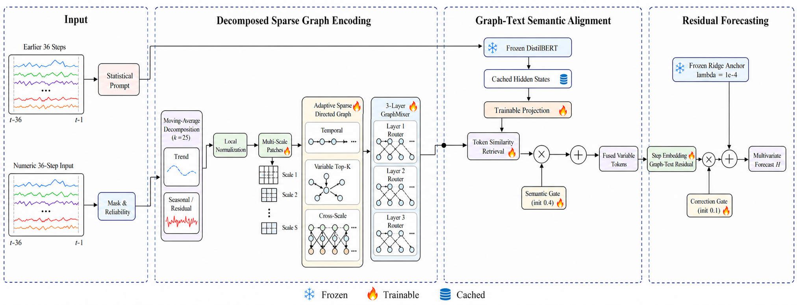

# AnchoredGTR：模型方法

本文给出 AnchoredGTR（Anchored Graph-Text Residual Forecasting）的完整方法定义。该模型面向多变量长序列预测：它首先把每个变量的历史序列表示为具有时间、尺度和变量关系的稀疏异质图，再通过冻结 DistilBERT 编码由更早历史窗口生成的统计文本报告，最后以只使用训练集拟合的冻结 ridge 回归作为线性预测锚点，由图—文本分支学习锚点未解释的非线性残差。

除特别说明外，下述公式均对应当前项目代码，而非仅表示概念性设计。

## 1. 问题定义

给定一个包含 $F$ 个变量的时间序列，在每个样本中截取长度为 $L=36$ 的数值历史窗口

$$
\mathbf X\in\mathbb R^{B\times L\times F},
$$

以及对应的观测掩码 $\mathbf M$、可靠度 $\mathbf R$ 和变量有效掩码 $\mathbf m^v$。模型预测未来 $H\in\{24,36,48,60\}$ 步：

$$
\widehat{\mathbf Y}
=f_{\theta}\!\left(\mathbf X,\mathbf M,\mathbf R,\mathbf p\right),
\qquad
\widehat{\mathbf Y}\in\mathbb R^{B\times H\times F}.
\tag{1}
$$

其中，$\mathbf p$ 不是数值窗口 $\mathbf X$ 的重复文本化，而是由紧邻 $\mathbf X$ 之前的另一段 36 步历史生成的统计报告。因而模型实际利用了两种不同分辨率的历史信息：较早历史被压缩为语义报告，较近历史以完整数值形式进入图网络。目标值、验证集和测试集均不参与 prompt 阈值或 ridge anchor 的拟合。

本文使用的主要符号如下。

| 符号                      | 形状                  | 含义                  |
| ----------------------- | ------------------- | ------------------- |
| $\mathbf X$             | $B\times L\times F$ | 数值历史窗口，$L=36$       |
| $\mathbf M$             | $B\times L\times F$ | 观测掩码                |
| $\mathbf R$             | $B\times L\times F$ | 观测可靠度               |
| $\mathbf m^v$           | $B\times F$         | 变量有效掩码              |
| $\mathbf Y$             | $B\times H\times F$ | 预测目标                |
| $\mathbf p$             | text                | 更早 36 步上下文生成的样本相关报告 |
| $d$                     | scalar              | 隐空间维度，正式配置为 128     |
| $\mathcal V,\mathcal E$ | set                 | 图节点集合与边集合           |
| $K$                     | scalar              | 每个目标变量选择的跨变量入邻居数    |

## 2. 总体架构



**图 1. AnchoredGTR 总体结构。** 雪花表示冻结参数，火焰表示可训练参数，存储图标表示冻结 DistilBERT hidden state 的离线缓存。Semantic gate 控制检索文本写入图 token 的强度；correction gate 控制图—文本残差相对冻结 ridge anchor 的修正幅度。为保证公式无歧义，最终预测严格按式（44）计算，即 ridge 预测与 correction gate 调制后的残差在最后一个加法节点相加。

模型由四个阶段组成：

1. **分解增强的图节点表示。** 对数值历史执行移动平均分解和按变量局部标准化，把多尺度局部片段及完整趋势/季节上下文共同编码为节点。
2. **自适应稀疏图学习。** 构造时间边、跨尺度边和跨变量有向 Top-$K$ 边，再由三层关系门控 GraphMixer 聚合局部与全局信息。
3. **图—文本语义对齐。** 冻结 DistilBERT 编码统计 prompt，通过 token 相似度检索和 semantic gate 将相关文本语义写入变量与 router token。
4. **Ridge 锚定的残差预测。** 冻结的 train-only ridge anchor 提供强线性预测；图—文本分支按预测步生成残差，并由 correction gate 自适应限制修正幅度。

该结构仍然是图神经网络模型。AnchoredGTR 没有删除稀疏图、GraphMixer 或文本通道，只改变了进入图网络的节点表示和线性 anchor 的初始化/训练策略。

## 3. 分解增强的多尺度图节点表示

### 3.1 掩码历史与移动平均分解

首先用观测掩码抑制缺失值：

$$
\bar{\mathbf X}=\mathbf X\odot\mathbf M.
\tag{2}
$$

对每个样本和变量，将序列两端分别复制填充 12 个位置，再施加核宽为 25、步长为 1 的平均池化。趋势项和季节/残差项分别为

$$
\mathbf T
=\operatorname{AvgPool}_{25}
\!\left(\operatorname{RepPad}_{12}(\bar{\mathbf X})\right),
\qquad
\mathbf S=\bar{\mathbf X}-\mathbf T.
\tag{3}
$$

复制边界填充使 $\mathbf T$ 与原序列长度一致，并避免零填充在窗口首尾引入额外突变。这里的 $\mathbf S$ 是相对于 25 点移动平均的高频分量，代码中称为 `seasonal`；它不要求序列具有严格的季节周期。

### 3.2 完整历史上下文编码

趋势项和季节项分别输入结构相同但参数独立的历史编码器：

$$
E(\mathbf x)
=\operatorname{LN}_2\!\left(
W_2\operatorname{Dropout}
\left(\operatorname{GELU}(W_1\operatorname{LN}_1(\mathbf x)+\mathbf b_1)\right)
+\mathbf b_2\right),
\tag{4}
$$

其中 $W_1\in\mathbb R^{d\times L}$、$W_2\in\mathbb R^{d\times d}$。变量 $f$ 的完整序列上下文为

$$
\mathbf c_f
=\frac{E_{\mathrm{tr}}(\mathbf T_{:,f})
+E_{\mathrm{seas}}(\mathbf S_{:,f})}{\sqrt 2}
\in\mathbb R^d.
\tag{5}
$$

除以 $\sqrt 2$ 用于控制两路表示相加后的幅度。无效变量的 $\mathbf c_f$ 由变量掩码置零。

### 3.3 按变量局部标准化

完整趋势/季节上下文保留窗口的绝对结构，而局部 patch 使用按变量标准化的序列，以减少变量量纲和绝对幅值对局部形状编码的支配。对每个样本和变量 (f)，令

$$
n_f=\max\!\left(1,\sum_{t=1}^{L}M_{t,f}\right),
\qquad
\mu_f=\frac{1}{n_f}\sum_{t=1}^{L}M_{t,f}X_{t,f},
\tag{6}
$$

$$
\sigma_f^2
=\frac{1}{n_f}\sum_{t=1}^{L}
M_{t,f}(X_{t,f}-\mu_f)^2,
\qquad
\widetilde X_{t,f}
=\frac{M_{t,f}(X_{t,f}-\mu_f)}{\sqrt{\sigma_f^2+10^{-5}}}.
\tag{7}
$$

缺失位置在标准化后保持为零；其缺失状态仍由观测位显式传入节点投影，因此零值不会被误认为真实观测。

### 3.4 自适应多尺度 patch

多尺度宽度随变量数量自适应变化：

$$
\mathcal W(F)=
\begin{cases}
\{2,4,8\}, & F\le 64,\\
\{4,8,16\}, & F>64.
\end{cases}
\tag{8}
$$

对尺度 (s) 的宽度 (w_s)，序列被划分为

$$
P_s=\left\lceil\frac{L}{w_s}\right\rceil
\tag{9}
$$

个不重叠 patch；末尾不足一个 patch 时补零，但覆盖率分母只计算原序列中实际可能存在的时间位置。patch 只有在至少 50% 的可能时间点被观测且变量有效时才构成真实节点。

对变量 (f)、尺度 (s)、patch (j)，节点投影输入保留三类逐点信息：

$$
\mathbf a_{f,s,j}
=\left[
\widetilde{\mathbf x}_{f,s,j}\odot\mathbf m_{f,s,j};
\mathbf m_{f,s,j};
\mathbf r_{f,s,j}\odot\mathbf m_{f,s,j}
\right]\in\mathbb R^{3w_s}.
\tag{10}
$$

因此模型并未先把每个 patch 压缩为均值、方差等手工统计量，而是保留 patch 内的数值、观测位和可靠度序列。每个尺度使用独立线性投影 $W_s\in\mathbb R^{d\times3w_s}$。定义归一化中心位置

$$
\rho_{s,j}=\frac{t^{\mathrm{start}}_{s,j}+t^{\mathrm{end}}_{s,j}-1}
{2\max(L-1,1)},
\tag{11}
$$

则初始节点表示为

$$
\mathbf z^{(0)}_{f,s,j}
=\operatorname{LN}\!\left(
W_s\mathbf a_{f,s,j}
+\mathbf e_f^{\mathrm{var}}
+\mathbf e_s^{\mathrm{scale}}
+W_p\rho_{s,j}
+\mathbf e_f^{\mathrm{type}}
+\mathbf c_f
\right).
\tag{12}
$$

式（12）同时包含局部形状、完整 36 步分解上下文、变量身份、尺度、相对时间位置和变量类型。经过 dropout 后，无效节点再次由节点掩码置零。

## 4. 自适应稀疏异质图构建

### 4.1 变量级动态表示

为了从多尺度 patch token 中估计变量关系，先对同一变量的所有有效节点执行注意力池化。令 $\mathcal P_f$ 为变量 $f$ 的节点集合，

$$
q_n=\mathbf w_{\mathrm{pool}}^\top\mathbf z_n^{(0)},
\qquad
a_n=\frac{\exp(q_n)}{\sum_{m\in\mathcal P_f}\exp(q_m)},
\qquad
\mathbf u_f=\sum_{n\in\mathcal P_f}a_n\mathbf z_n^{(0)}.
\tag{13}
$$

池化只在有效节点上归一化。由独立 query/key 投影得到有向动态关系：

$$
s^{\mathrm{dyn}}_{d\leftarrow s}
=\frac{(W_q\mathbf u_d)^\top(W_k\mathbf u_s)}
{\|W_q\mathbf u_d\|_2\,\|W_k\mathbf u_s\|_2}.
\tag{14}
$$

独立的 $W_q$ 和 $W_k$ 允许 $s_{d\leftarrow s}\ne s_{s\leftarrow d}$，从而保留方向性。

### 4.2 差分相关与静态关系

原序列的一阶差分为

$$
\Delta X_{t,f}=X_{t,f}-X_{t-1,f},
\tag{15}
$$

仅当相邻两个时间点均被观测时，该差分才有效。对共同有效位置计算带掩码协方差和标准差，得到有符号相关系数

$$
s^{\Delta\mathrm{corr}}_{d,s}
=\frac{\operatorname{Cov}_M(\Delta\mathbf x_d,\Delta\mathbf x_s)}
{\sqrt{\operatorname{Var}_M(\Delta\mathbf x_d)}
\sqrt{\operatorname{Var}_M(\Delta\mathbf x_s)}+\varepsilon}.
\tag{16}
$$

这里不取绝对值，因此正相关和负相关具有不同语义。静态关系由可学习变量 embedding 的余弦相似度给出：

$$
s^{\mathrm{static}}_{d,s}
=\frac{(\mathbf e_d^{\mathrm{rel}})^\top\mathbf e_s^{\mathrm{rel}}}
{\|\mathbf e_d^{\mathrm{rel}}\|_2\|\mathbf e_s^{\mathrm{rel}}\|_2}.
\tag{17}
$$

三个分量通过可学习 softmax 权重组合：

$$
\boldsymbol\pi=\operatorname{softmax}(\boldsymbol\alpha),
\qquad
s_{d\leftarrow s}
=\pi_1s^{\mathrm{dyn}}_{d\leftarrow s}
+\pi_2s^{\Delta\mathrm{corr}}_{d,s}
+\pi_3s^{\mathrm{static}}_{d,s}.
\tag{18}
$$

### 4.3 自适应有向 Top-$K$ 变量边

对每个样本，按有效变量数量确定入邻居数：

$$
K=\min\!\left(
F_{\mathrm{valid}}-1,
16,
\max\!\left(8,
\left\lceil2\log_2F_{\mathrm{valid}}\right\rceil
\right)\right).
\tag{19}
$$

当 $F_{\mathrm{valid}}\le9$ 时，式（19）自然给出 $K=F_{\mathrm{valid}}-1$，即完全变量图；变量数量较大时，邻居数最多为 16。对每个目标变量 $d$，从非自身、有效来源变量中选择得分最高的 $K$ 个来源：

$$
\mathcal N_v(d)=\operatorname{TopK}_{s\ne d}
\left(\operatorname{stopgrad}(s_{d\leftarrow s}),K\right).
\tag{20}
$$

停止梯度只作用于离散 Top-$K$ 索引选择；被选中边的连续 prior 仍取自未 detach 的 $s_{d\leftarrow s}$，因而式（18）的混合权重和动态/静态映射仍可训练。

### 4.4 三类显式关系

图中保留三种结构边。

1. **时间关系 $\mathcal E_{\mathrm{temp}}$。** 同一变量、同一尺度中，patch 索引距离为 1 或 2 的节点双向连接；两者的边 prior 分别为 0.35 和 0.15。
2. **跨尺度关系 $\mathcal E_{\mathrm{cross}}$。** 同一变量、不同尺度且时间区间重叠的 patch 节点连接，prior 固定为 0.25。
3. **变量关系 $\mathcal E_{\mathrm{var}}$。** 在相同 patch 组内，将每个 $s\in\mathcal N_v(d)$ 的来源节点连接到目标变量 $d$ 的节点，prior 为式（18）的关系得分。

最终边集合为

$$
\mathcal E
=\mathcal E_{\mathrm{temp}}
\cup\mathcal E_{\mathrm{cross}}
\cup\mathcal E_{\mathrm{var}}.
\tag{21}
$$

节点有效掩码在批量展开边模板时再次应用，缺失变量和覆盖不足的 patch 不产生消息传递边。

## 5. 关系门控 GraphMixer

### 5.1 带边 prior 的关系注意力

对关系 $r\in\{\mathrm{temp,var,cross}\}$ 和注意力头 $h$，从来源节点 $j$ 到目标节点 $i$ 的打分为

$$
e_{ij,r}^{(h)}
=\frac{(W_{Q,r}^{(h)}\mathbf z_i)^\top
(W_{K,r}^{(h)}\mathbf z_j)}{\sqrt{d_h}}
+p_{ij,r},
\tag{22}
$$

其中 (p_{ij,r}) 是上一节给出的边 prior。注意力在具有相同目标节点的入边上执行 segment softmax：

$$
\alpha_{ij,r}^{(h)}
=\frac{\exp(e_{ij,r}^{(h)})}
{\sum_{j'\in\mathcal N_r(i)}\exp(e_{ij',r}^{(h)})}.
\tag{23}
$$

关系消息为

$$
\mathbf m_{i,r}
=W_{O,r}\operatorname{Concat}_{h=1}^{N_h}
\left(\sum_{j\in\mathcal N_r(i)}
\alpha_{ij,r}^{(h)}W_{V,r}^{(h)}\mathbf z_j\right).
\tag{24}
$$

正式配置采用 (N_h=4) 个注意力头。

### 5.2 Router 全局通路

每个样本的 router 数量由有效变量数决定：

$$
R_b=\operatorname{clip}
\left(\left\lceil\sqrt{F_{\mathrm{valid},b}}\right\rceil,4,16\right).
\tag{25}
$$

这里的 router 不是原始时间序列产生的真实图节点，也不是混合专家模型中负责把样本分配给不同专家的路由器，而是一组共享的、可训练的全局隐 token。它们从参数矩阵 $\mathbf U^{(0)}\in\mathbb R^{R\times d}$ 初始化；同一组 query 在 batch 内共享，但经过每层 GraphMixer 后会吸收各个样本自身的图信息，因此形成样本相关的全局表示。

设某一层的有效图节点为 $\mathbf Z\in\mathbb R^{N_p\times d}$，router token 为 $\mathbf U\in\mathbb R^{R\times d}$。节点以 router 为 key/value 接收全局广播消息：

$$
\mathbf M_{Z\leftarrow U}
=\operatorname{MHA}\!\left(
Q=\operatorname{LN}(\mathbf Z),
K=\operatorname{LN}(\mathbf U),
V=\operatorname{LN}(\mathbf U)
\right).
$$

与此同时，router 以全部有效节点为 key/value 汇聚全图信息：

$$
\Delta\mathbf U
=\operatorname{MHA}\!\left(
Q=\operatorname{LN}(\mathbf U),
K=\operatorname{LN}(\mathbf Z),
V=\operatorname{LN}(\mathbf Z)
\right).
$$

第一条通路把少量全局摘要广播给全部节点，第二条通路则把不同变量、时间 patch 和尺度的信息压缩进 router；router 随后通过残差连接和独立 FFN 更新。因而，即使两个变量没有被 Top-$K$ 规则直接连边，也可以经过“节点 $\rightarrow$ router $\rightarrow$ 节点”的两跳通路交换信息。router 不替代时间边、变量边或跨尺度边，而是作为第四类消息与三类结构消息并行，再由式（26）—（27）的节点相关 relation gate 自适应决定各节点使用多少全局信息。

相对于同一 patch 组中 $F(F-1)$ 条完全变量边，router 通路的计算复杂度约为 $\mathcal O(N_pR)$，且 $R\le16$，因此可在 ECL 等高维场景中补偿 Top-$K$ 稀疏化带来的全局信息损失，而不恢复二次增长的边数。三层 GraphMixer 后，变量 token 与 router token 会共同作为查询检索 DistilBERT token，并共同参与样本级 semantic gate 和图—文本对齐上下文的计算；通用预测头最终仍读取融合后的变量 token，所以 router 对预测主要产生间接影响。

### 5.3 节点相关的关系门控

三类结构消息和 router 消息并行计算。每个节点根据其归一化表示产生四路 softmax 权重：

$$
\boldsymbol\gamma_i
=\operatorname{softmax}\!\left(W_\gamma\operatorname{LN}(\mathbf z_i)\right),
\tag{26}
$$

$$
\Delta\mathbf z_i
=\sum_{r\in\{\mathrm{temp,var,cross,router}\}}
\gamma_{i,r}\mathbf m_{i,r}.
\tag{27}
$$

节点更新采用残差连接和前馈网络：

$$
\mathbf z_i'
=\mathbf z_i+\operatorname{Dropout}(\Delta\mathbf z_i),
\qquad
\mathbf z_i^{+}
=\mathbf z_i'
+\operatorname{Dropout}\!\left(
\operatorname{FFN}(\operatorname{LN}(\mathbf z_i'))\right).
\tag{28}
$$

FFN 的扩展比例为 2，结构为 `Linear(d,2d)–GELU–Dropout–Linear(2d,d)`。router 使用对应的残差 FFN 更新。模型连续堆叠三层 GraphMixer。

### 5.4 变量 token 池化

三层传播后，再对每个变量的所有尺度和时间 patch 执行可学习注意力池化：

$$
\mathbf v_f
=\sum_{n\in\mathcal P_f}
\frac{\exp(\mathbf w_v^\top\mathbf z_n)}
{\sum_{m\in\mathcal P_f}\exp(\mathbf w_v^\top\mathbf z_m)}
\mathbf z_n.
\tag{29}
$$

由此得到变量 token $\mathbf V\in\mathbb R^{B\times F\times d}$ 和 router token $\mathbf U\in\mathbb R^{B\times R\times d}$，供文本检索与预测头使用。

## 6. 文本报告编码与语义对齐

### 6.1 样本相关的统计 prompt

Prompt 来源于数值输入之前的另一段 36 步上下文 $\mathbf C\in\mathbb R^{36\times F}$。首先用每个变量的中位数和尺度进行稳健归一化：

$$
c_f=\operatorname{median}_t(C_{t,f}),
\qquad
s_f=1.4826\operatorname{median}_t|C_{t,f}-c_f|,
\tag{30}
$$

当 MAD 过小或无效时，代码依次回退到标准差和 1。随后计算并写入固定格式的简短报告：

- 全窗口归一化斜率、最近 12 步斜率及相对最早 12 步的动量；
- 下降、稳定和上升变量的比例；
- 各变量稳健归一化后中位序列的 FFT 主周期及谱能量占比；
- 最近 12 步相对最早 12 步的稳健波动倍率；
- 最多 32 个均匀选取变量的一阶差分相关绝对值中位数；
- 前 18 步和后 18 步之间的稳健水平漂移；
- 缺失比例以及稳健 (z)-score 大于 4 的异常比例。

周期强度、差分依赖等文字等级的分位数边界只使用训练窗口拟合。由于统计量依赖具体历史窗口，不同样本通常生成不同 prompt。文本不逐点复述数值输入，因此与数值图分支形成互补，而不是并行重复编码。

### 6.2 冻结 DistilBERT 与可训练投影

Prompt 经 tokenizer 截断或填充到最多 128 个 token，由本地 DistilBERT 主干编码：

$$
\mathbf H^p
=\operatorname{DistilBERT}_{\mathrm{frozen}}(\mathbf p)
\in\mathbb R^{B\times T_p\times d_{\mathrm{BERT}}}.
\tag{31}
$$

DistilBERT 主干参数冻结且始终保持 evaluation 状态。为了减少重复计算，正式训练可把主干输出以 CPU BF16 hidden state 和布尔 mask 的形式预计算到磁盘，再安装到内存缓存。缓存位于可训练投影之前：

$$
\mathbf E^p=W_p\mathbf H^p+\mathbf b_p
\in\mathbb R^{B\times T_p\times d}.
\tag{32}
$$

因此 $W_p,\mathbf b_p$ 仍参与训练；缓存不会使整个文本通道失去梯度。

### 6.3 TimeCMA 式 token 相似度检索

将变量和 router token 拼接为图查询：

$$
\mathbf Q=[\mathbf V;\mathbf U]
\in\mathbb R^{B\times(F+R)\times d}.
\tag{33}
$$

对每个有效图 token (i) 与文本 token (t)，计算

$$
A_{i,t}
=\operatorname{softmax}_{t}\left(
\frac{(W_q\mathbf q_i)^\top(W_k\mathbf e_t^p)}{\sqrt d}
\right),
\qquad
\mathbf r_i
=\sum_{t=1}^{T_p}A_{i,t}W_v\mathbf e_t^p.
\tag{34}
$$

无效文本位置在 softmax 前被屏蔽，无效图查询在 softmax 后置零。检索结果再经过 `LayerNorm–Linear–Dropout` 变换。该过程不是为整个样本选取一个句向量，而是允许每个变量/router token 从 prompt token 序列中检索不同的语义信息。

### 6.4 Semantic gate

令 $\mathbf c_g$ 为全部有效原始图查询的掩码均值，$\mathbf c_t$ 为对应检索特征的掩码均值。样本级 semantic gate 为

$$
g_{\mathrm{sem}}
=\sigma\!\left(
\operatorname{MLP}_{\mathrm{sem}}
([\mathbf c_g;\mathbf c_t;\mathbf c_g\odot\mathbf c_t])
\right)\in(0,1),
\tag{35}
$$

$$
\widetilde{\mathbf q}_i
=\mathbf q_i+g_{\mathrm{sem}}\widetilde{\mathbf r}_i.
\tag{36}
$$

门控 MLP 为 `LayerNorm(3d)–Linear(3d,d)–GELU–Linear(d,1)`。最后一层权重初始化为零，偏置初始化为 $\operatorname{logit}(0.4)$，因此训练开始时 $g_{\mathrm{sem}}=0.4$。该 gate 对一个样本内全部变量和 router 共享，但会随样本的图—文本上下文改变。

用于对比学习的图表示和文本表示分别为

$$
\mathbf a_g=\operatorname{MeanMask}_i(W_q\mathbf q_i),
\qquad
\mathbf a_t=\mathbf c_t.
\tag{37}
$$

## 7. Ridge-Frozen Anchor 与门控残差预测

### 7.1 共享 train-only ridge anchor

AnchoredGTR 不随机初始化并联合训练线性 anchor，而是在神经网络训练前，用训练划分中的所有有效数值窗口拟合共享 ridge 回归。每个“训练样本—变量”组合构成一行历史向量 $\mathbf x_n\in\mathbb R^L$ 和未来目标 $\mathbf y_n\in\mathbb R^H$：

$$
(\mathbf W_r,\mathbf b_r)
=\arg\min_{\mathbf W,\mathbf b}
\sum_{n=1}^{N_r}
\left\|\mathbf y_n-\mathbf W\mathbf x_n-\mathbf b\right\|_2^2
+\lambda\|\mathbf W\|_F^2,
\qquad \lambda=10^{-4}.
\tag{38}
$$

该映射在变量间共享，即所有变量共同估计一个 $L\rightarrow H$ 预测器，而不是为每个变量建立独立参数。令

$$
\widetilde{\mathbf X}_r=[\mathbf X_r,\mathbf 1],
\qquad
\mathbf D=\operatorname{diag}
(\underbrace{1,\ldots,1}_{L},0),
\tag{39}
$$

则闭式解为

$$
\mathbf\Theta
=\left(\widetilde{\mathbf X}_r^\top\widetilde{\mathbf X}_r
+\lambda\mathbf D\right)^{-1}
\widetilde{\mathbf X}_r^\top\mathbf Y_r.
\tag{40}
$$

最后一个增广维度对应截距，因此 $\mathbf D$ 的最后一个对角元素为零，截距不被正则化。实际实现按数据块累计 Gram 矩阵和右端充分统计量，不为 ECL 等宽数据集一次性物化全部变量窗口。

只有训练划分的标准化数值序列和训练窗口起点参与式（40）；验证集、测试集以及 prompt 上下文均不参与 ridge 拟合。解出的权重和偏置写入 `Linear(36,60)` 的前 $H$ 个输出位置，随后二者均设置 `requires_grad=False`。对历史窗口的基础预测为

$$
\widehat{\mathbf Y}^{\mathrm{ridge}}
=\mathbf X\mathbf W_r^\top+\mathbf b_r.
\tag{41}
$$

### 7.2 预测步条件化的图—文本残差

从式（36）取融合后的变量 token $\widetilde{\mathbf v}_f$，并为每个预测步 $h$ 引入可学习 step embedding $\mathbf e_h^{\mathrm{step}}$：

$$
\mathbf u_{b,h,f}
=\operatorname{LN}\left(
\widetilde{\mathbf v}_{b,f}+\mathbf e_h^{\mathrm{step}}
\right).
\tag{42}
$$

残差 MLP 和 correction-gate MLP 相互独立：

$$
\Delta\widehat y_{b,h,f}
=\phi_{\Delta}(\mathbf u_{b,h,f}),
\qquad
g^{\mathrm{corr}}_{b,h,f}
=\sigma\!\left(\phi_g(\mathbf u_{b,h,f})\right).
\tag{43}
$$

$\phi_\Delta$ 为 `Linear(d,d)–GELU–Dropout–Linear(d,1)`；$\phi_g$ 为 `Linear(d,d)–GELU–Linear(d,1)`。correction gate 最后一层权重初始化为零，偏置为 $\operatorname{logit}(0.1)$，因此初始 $g^{\mathrm{corr}}=0.1$。

最终预测为

$$
\boxed{
\widehat y_{b,h,f}
=\widehat y^{\mathrm{ridge}}_{b,h,f}
+g^{\mathrm{corr}}_{b,h,f}
\Delta\widehat y_{b,h,f}}
\tag{44}
$$

并由变量有效掩码将无效变量输出置零。冻结 anchor 保护训练集线性解不被联合优化破坏；图—文本网络只能通过式（44）的第二项学习 ridge 未解释的残差。

### 7.3 两类 gate 的区别

| 门控              | 粒度          | 输入                        | 被控制的信息                    | 初始值 |
| --------------- | ----------- | ------------------------- | ------------------------- | ---:|
| Semantic gate   | 每个样本一个标量    | 图上下文、文本上下文及逐元素交互          | 文本检索结果写入图 token           | 0.4 |
| Correction gate | 每个样本×预测步×变量 | 融合变量 token 与预测步 embedding | 图—文本残差相对 ridge anchor 的幅度 | 0.1 |

Semantic gate 位于跨模态融合阶段，回答“该样本是否需要文本语义”；correction gate 位于输出阶段，回答“在某个变量和预测步上应当修正线性 anchor 多少”。两者既不共享参数，也不具有相同粒度。

## 8. 训练目标

### 8.1 带掩码的 Smooth L1 预测损失

定义误差 $e=\widehat y-y$。通用预测任务采用 $\beta=1$ 的 Smooth L1：

$$
\ell_{\mathrm{SL1}}(e)=
\begin{cases}
\frac12e^2, & |e|<1,\\
|e|-\frac12, & |e|\ge1.
\end{cases}
\tag{45}
$$

若目标有效掩码为 $\mathbf M^Y$，则

$$
\mathcal L_{\mathrm{value}}
=\frac{
\sum_{b,h,f}M^Y_{b,h,f}
\ell_{\mathrm{SL1}}(\widehat Y_{b,h,f}-Y_{b,h,f})}
{\max\!\left(1,\sum_{b,h,f}M^Y_{b,h,f}\right)}.
\tag{46}
$$

Smooth L1 在小误差区间保持二次惩罚，在大误差区间转为线性惩罚，比纯 MSE 对通用数据集中突变和异常波动更稳健。MSE、MAE 和 RMSE 只用于验证、早停和测试评估，并非训练目标。

### 8.2 对称 NT-Xent 图—文本对齐

对式（37）的表示做 $L_2$ 归一化：

$$
\bar{\mathbf a}_{g,b}=\frac{\mathbf a_{g,b}}{\|\mathbf a_{g,b}\|_2},
\qquad
\bar{\mathbf a}_{t,b}=\frac{\mathbf a_{t,b}}{\|\mathbf a_{t,b}\|_2}.
\tag{47}
$$

令温度 (    au=0.2)，批内相似度为

$$
\ell_{ij}=\frac{\bar{\mathbf a}_{g,i}^\top\bar{\mathbf a}_{t,j}}{\tau}.
\tag{48}
$$

对称 NT-Xent 损失为

$$
\mathcal L_{\mathrm{NTX}}
=\frac12\left[
-\frac1B\sum_{i=1}^{B}
\log\frac{\exp(\ell_{ii})}{\sum_j\exp(\ell_{ij})}
-\frac1B\sum_{i=1}^{B}
\log\frac{\exp(\ell_{ii})}{\sum_j\exp(\ell_{ji})}
\right].
\tag{49}
$$

当文本关闭、对齐权重不为正或 batch size 为 1 时，对齐项为零。总损失为

$$
\boxed{
\mathcal L
=\mathcal L_{\mathrm{value}}
+\lambda_{\mathrm{align}}\mathcal L_{\mathrm{NTX}}}.
\tag{50}
$$

正式默认训练在前 5 个 epoch 仅优化预测目标；从 epoch 6 开始线性增加 $\lambda_{\mathrm{align}}$，在 epoch 15 达到 $10^{-3}$。

### 8.3 优化与早停

可训练参数由 AdamW 优化。文本投影与 semantic-fusion 参数构成 semantic 参数组，默认学习率为 $3\times10^{-4}$；其余可训练参数构成 core 参数组，默认学习率为 $10^{-3}$。权重衰减为 $10^{-4}$，前 5 个 epoch 线性 warm-up，梯度范数裁剪为 1。冻结 DistilBERT 和 ridge anchor 不进入优化器。

验证 MSE 驱动 `ReduceLROnPlateau`：默认停滞 4 个 epoch 后学习率乘 0.5。受保护早停要求验证集连续 20 个 epoch 未刷新且至少已经发生两次学习率下降，避免模型在学习率尚未充分退火时过早终止。

## 9. 复杂度与实现配置

### 9.1 图规模

局部 patch 节点数为

$$
N_p
=F\sum_{w_s\in\mathcal W(F)}
\left\lceil\frac{L}{w_s}\right\rceil.
\tag{51}
$$

若跨变量关系采用完全图，同一 patch 组的边数为 $F(F-1)$；AnchoredGTR 的自适应变量图约为 $FK$，其中 $K\le16$。设 patch 组数为 $G_p$，跨变量边复杂度由

$$
\mathcal O(G_pF^2)
\quad\text{降低为}\quad
\mathcal O(G_pFK).
\tag{52}
$$

时间边和跨尺度边由固定 patch 几何关系决定；router 通路的复杂度约为 $\mathcal O(N_pR)$，且 $R\le16$。因此模型在 ECL 等高变量场景中避免了跨变量边数的二次增长，同时仍借助 router 保留全局感受野。

### 9.2 正式配置

| 配置项                 | 数值或规则                                                             |
| ------------------- | ----------------------------------------------------------------- |
| 数值历史长度              | $L=36$                                                            |
| 预测长度                | $H\in\{24,36,48,60\}$                                             |
| 隐空间宽度               | $d=128$                                                           |
| GraphMixer 层数       | 3                                                                 |
| 注意力头数               | 4                                                                 |
| FFN 扩展比例            | 2                                                                 |
| Dropout             | 0.1                                                               |
| 多尺度宽度               | $F\le64:2/4/8;\ F>64:4/8/16$                                      |
| 移动平均核宽              | 25                                                                |
| 最大变量邻居数             | 16                                                                |
| Router 数量           | $\operatorname{clip}(\lceil\sqrt{F_{\mathrm{valid}}}\rceil,4,16)$ |
| 最大节点数               | 6000                                                              |
| DistilBERT token 上限 | 128                                                               |
| Ridge 系数            | (10^{-4})                                                         |
| Semantic gate 初始值   | 0.4                                                               |
| Correction gate 初始值 | 0.1                                                               |
| NT-Xent 温度          | 0.2                                                               |

## 10. 端到端算法

```text
算法 1  AnchoredGTR 的训练准备与前向传播

输入：训练时间序列；数值窗口 X；观测掩码 M；可靠度 R；
      更早历史 C；预测长度 H
输出：未来预测 Y_hat

训练前：
 1: 从训练划分收集全部“窗口–变量”回归行
 2: 用 λ=1e-4 拟合共享 ridge anchor；不使用验证集或测试集
 3: 将 ridge 权重和偏置写入 linear anchor，并冻结两者
 4: 用训练窗口拟合 prompt 统计量的分位数阈值
 5: 可选：预计算并缓存冻结 DistilBERT 的 prompt hidden state

对每个批次：
 6: 由更早 36 步上下文 C 构造样本相关统计 prompt p
 7: 用 M 屏蔽 X，并以 25 点移动平均分解为趋势 T 与残差 S
 8: 按变量局部标准化 X，构造多尺度 patch 节点
 9: 将趋势/残差完整历史上下文注入每个对应变量的 patch 节点
10: 构造 temporal、cross-scale 和自适应 Top-K variable 边
11: 通过三层关系门控 GraphMixer 和 router 通路传播信息
12: 将 patch 节点池化为变量 token
13: 用冻结 DistilBERT hidden state 和可训练投影得到文本 token
14: 对每个图 token 执行文本 token 相似度检索
15: 通过样本级 semantic gate 融合图 token 与检索文本
16: 用冻结 ridge anchor 计算基础预测 Y_ridge
17: 结合预测步 embedding 生成图—文本残差 ΔY 和 correction gate
18: Y_hat = Y_ridge + correction_gate ⊙ ΔY
19: 以 Smooth L1 + 加权 NT-Xent 更新全部非冻结参数
```

## 11. 与原版 GraphReportTS-v2 的差异

| 组件                     | 原版 GraphReportTS-v2          | AnchoredGTR           |
| ---------------------- | ---------------------------- | ------------------------------ |
| 图输入节点                  | 原始多尺度 patch                  | 局部标准化 patch + 25 点趋势/残差完整上下文   |
| 图 embedding 选项         | `patch`                      | `series_context_decomp`        |
| Linear anchor 初始化      | 随机初始化                        | 仅训练集共享 ridge，$\lambda=10^{-4}$ |
| Linear anchor 训练       | 与主网络联合训练                     | 权重和偏置全程冻结                      |
| 稀疏变量图                  | 保留                           | 保留，未改变                         |
| 三层 GraphMixer 与 router | 保留                           | 保留，未改变                         |
| Prompt 与冻结 DistilBERT  | 保留                           | 保留，未改变                         |
| Semantic gate          | 保留                           | 保留，未改变                         |
| Correction gate        | 保留                           | 保留，未改变                         |
| 预测含义                   | 可训练 anchor 与 correction 联合适配 | 图—文本分支学习固定 ridge 未解释的残差        |

因此，AnchoredGTR 的核心归纳偏置是“**完整序列分解增强的图表示 + 受保护的强线性锚点 + 图文门控残差**”。现有实验把 `series_context_decomp` 作为一个整体 embedding 策略，并把“ridge 初始化后冻结”作为一个整体 anchor 策略；不能据此把性能变化单独归因于趋势分解、局部标准化、ridge 初始化或冻结中的任一单项。

#
